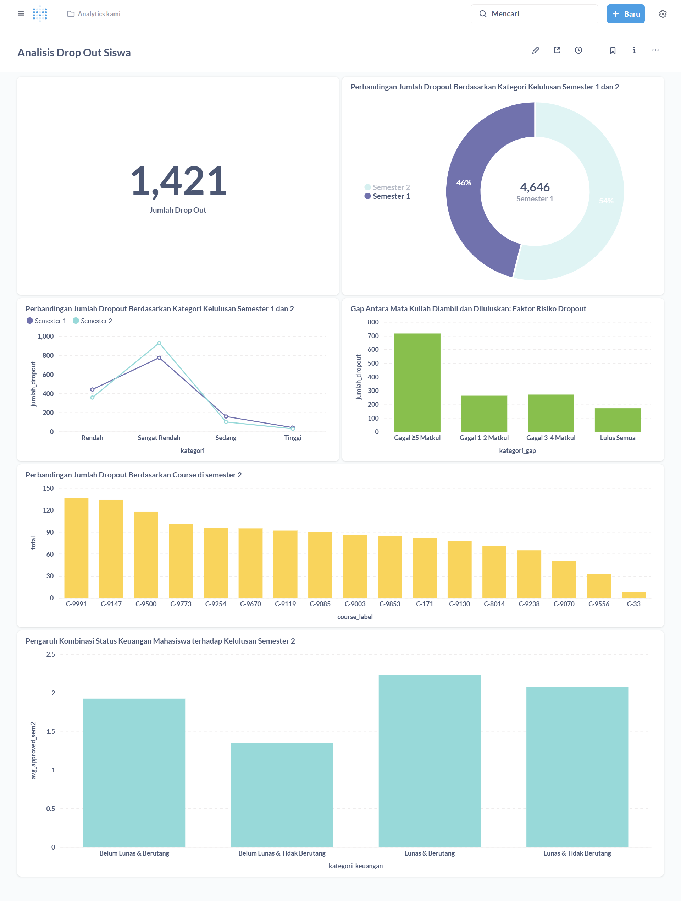

# Proyek Akhir: Menyelesaikan Permasalahan Perusahaan Edutech

## Business Understanding

Jaya Jaya Institut merupakan sebuah institusi pendidikan tinggi yang telah berdiri sejak tahun 2000 dan memiliki reputasi yang cukup kuat dalam menghasilkan lulusan berkualitas. Namun, dalam beberapa tahun terakhir, institusi ini menghadapi tantangan serius dalam bentuk tingginya angka mahasiswa yang tidak menyelesaikan studinya alias dropout.

Masalah ini bukan hanya berdampak pada performa akademik institusi, tetapi juga dapat merusak reputasi, membebani anggaran, dan mengganggu proses operasional akademik jangka panjang. Oleh karena itu, pihak institusi berupaya mengembangkan solusi berbasis data untuk mengidentifikasi mahasiswa yang memiliki risiko tinggi untuk dropout, sehingga dapat diberikan intervensi atau bimbingan yang tepat waktu.

Departemen akademik dan manajemen Jaya Jaya Institut menyadari bahwa pendekatan konvensional tidak cukup. Mereka membutuhkan sistem prediksi berbasis machine learning yang dapat menganalisis berbagai variabel mahasiswa dan menghasilkan skor risiko dropout. Hasil dari sistem ini nantinya akan disajikan dalam bentuk dashboard interaktif untuk memudahkan pemantauan dan pengambilan keputusan.

## Urgensi Permasalahan

Permasalahan dropout ini perlu segera ditangani karena:

- Terjadi secara konsisten di berbagai program studi dan angkatan.
- Menghambat efektivitas penggunaan anggaran pendidikan.
- Berdampak negatif terhadap citra dan daya saing institusi di mata publik.
- Menyulitkan perencanaan akademik jangka panjang.

Dengan mendeteksi risiko dropout secara lebih awal, institusi dapat melakukan pendekatan proaktif dan mengalokasikan sumber daya bimbingan secara lebih tepat sasaran.

## Risiko Jangka Panjang

Jika permasalahan dropout tidak ditangani secara sistematis, Jaya Jaya Institut berpotensi menghadapi:

- **Penurunan reputasi akademik**, sehingga minat calon mahasiswa baru berkurang.
- **Kerugian finansial**, karena biaya pendidikan tidak sebanding dengan hasil kelulusan.
- **Overhead operasional**, akibat penyesuaian kurikulum dan beban administratif yang meningkat.
- **Kehilangan talenta potensial**, yaitu mahasiswa yang sebetulnya memiliki potensi untuk lulus namun tidak mendapatkan intervensi yang dibutuhkan.

## Fokus Analisis

Melalui proyek ini, pengembangan solusi dilakukan untuk:

- Mengidentifikasi faktor-faktor utama yang berkontribusi terhadap risiko mahasiswa untuk dropout, termasuk variabel akademik, sosial-ekonomi, dan historis.
- Membangun model machine learning yang mampu memberikan prediksi dropout secara individual.
- Menyediakan dashboard visual interaktif untuk memantau data mahasiswa dan mengambil kebijakan berdasarkan hasil prediksi.

Proyek ini diharapkan dapat membantu Jaya Jaya Institut dalam menekan angka dropout, meningkatkan efektivitas pendidikan, serta menjaga kualitas dan reputasi institusi dalam jangka panjang.


### Cakupan Proyek

Proyek ini dirancang untuk membantu Jaya Jaya Institut dalam memprediksi dan memonitor risiko dropout mahasiswa dengan pendekatan berbasis data. Adapun cakupan dari proyek ini mencakup beberapa tahapan sebagai berikut:

- **Eksplorasi dan Analisis Data**  
  Melakukan eksplorasi terhadap dataset performa mahasiswa yang terdiri dari 38 kolom, mencakup faktor akademik (seperti jumlah mata kuliah lulus/gagal), status keuangan, dan variabel sosial lainnya.

- **Data Preparation**  
  Melakukan pembersihan data, transformasi fitur, encoding variabel kategorikal, dan pembagian data menjadi training dan testing untuk keperluan model.

- **Pembangunan Model Machine Learning**  
  Menggunakan algoritma XGBoost untuk membangun model klasifikasi yang memprediksi apakah mahasiswa akan dropout, tidak lulus, atau lulus. Model dievaluasi menggunakan metrik akurasi dan F1-score.

- **Pembuatan Dashboard Interaktif**  
  Mengembangkan dashboard berbasis Metabase yang menyajikan visualisasi indikator dropout, termasuk jumlah mata kuliah gagal per semester, kursus dengan risiko tertinggi, dan hubungan antara performa dan status keuangan mahasiswa.

- **Pengembangan Prototype Prediksi**  
  Membangun aplikasi berbasis Streamlit untuk menguji model secara real-time dan memberikan prediksi terhadap status kelulusan mahasiswa berdasarkan input fitur tertentu.

- **Dokumentasi & Deployment**  
  Menyediakan dokumentasi proyek dalam format README dan mendukung deploy aplikasi ke Streamlit Community Cloud agar dapat diakses secara online.


## Persiapan

- **Sumber data**: [Students Performance Dataset — Dicoding GitHub](https://github.com/dicodingacademy/dicoding_dataset/tree/main/students_performance)  
- **Jumlah fitur**: 38 kolom  
- **Target**: `Target` (0 = Tidak Lulus, 1 = Dropout, 2 = Lulus)

### 1. Setup Environment

Untuk menjaga isolasi proyek dan menghindari konflik antar dependensi:

```bash
python -m venv venv
source venv/bin/activate        # Linux / macOS
venv\Scripts\activate           # Windows
```
### 2. Install Dependencies
Pastikan Anda berada di root folder proyek. Jalankan perintah berikut untuk menginstal semua dependensi:

```bash
pip install -r requirements.txt
```
**Library utama yang digunakan:**

- `pandas`, `numpy` – untuk manipulasi dan eksplorasi data.
- `scikit-learn`, `xgboost` – untuk pembangunan model machine learning dan evaluasi.
- `streamlit` – untuk membangun antarmuka aplikasi prediksi berbasis web.
- `matplotlib`, `seaborn` – untuk membuat visualisasi data (opsional).

### 3. File yang Dibutuhkan

Pastikan struktur folder proyek Anda mencakup file-file berikut:

- `app.py` – Aplikasi utama Streamlit yang digunakan untuk menjalankan prediksi dropout mahasiswa.
- `xgb_model.pkl` – File model machine learning (XGBoost) yang telah dilatih dan disimpan.
- `requirements.txt` – Daftar semua dependensi Python yang dibutuhkan untuk menjalankan proyek.
- `metabase.db.mv.db` – File database Metabase yang berisi konfigurasi dashboard.
- `faiq_rofifi-dashboard.png` – Screenshot tampilan dashboard yang menggambarkan visualisasi data performa mahasiswa.

### 4. Menjalankan Dashboard Metabase (Docker)

Jika Anda menggunakan Metabase untuk visualisasi performa mahasiswa, jalankan container-nya dengan perintah berikut:

```bash
docker run -d -p 3000:3000 \
  -v "$PWD/metabase-data":/metabase-data \
  -e "MB_DB_FILE=/metabase-data/metabase.db" \
  --name metabase-local metabase/metabase
```

Setelah container berjalan, buka browser dan akses:

```bash
http://localhost:3000
```
Gunakan kredensial berikut untuk login:

**Email**: mfaiqrofifi@mail.com

**Password**: root123


## Business Dashboard

Dashboard ini dibangun menggunakan **Metabase** dan berfungsi sebagai alat bantu visualisasi interaktif untuk membantu pihak Jaya Jaya Institut dalam memantau performa akademik mahasiswa serta mengidentifikasi pola yang mengarah pada risiko dropout.

Dashboard ini mencakup visualisasi berikut:

- **Perbandingan Jumlah Mata Kuliah Tidak Lulus di Semester 1 dan Semester 2**  
  Visualisasi ini menampilkan jumlah total mata kuliah yang gagal (DO) di setiap semester dari seluruh mahasiswa. Hasilnya menunjukkan bahwa semester 2 memiliki jumlah kegagalan lebih tinggi dibanding semester 1, menandakan bahwa semester 2 merupakan periode kritis dalam keberlangsungan studi mahasiswa.

- **Distribusi Mahasiswa Berdasarkan Status Pembayaran dan Kelulusan**  
  Grafik ini menunjukkan hubungan antara status pembayaran tuition fees mahasiswa dengan status kelulusan mereka (Dropout, Tidak Lulus, Lulus). Terlihat bahwa mahasiswa dengan status pembayaran tidak lancar memiliki kecenderungan lebih tinggi untuk dropout.

- **Distribusi Status Kelulusan Mahasiswa**  
  Pie chart atau bar chart ini menunjukkan proporsi mahasiswa dalam tiga kategori: Dropout, Tidak Lulus, dan Lulus. Visualisasi ini memberikan gambaran umum tentang tingkat keberhasilan akademik institusi.

- **Peringkat Mata Kuliah Berdasarkan Jumlah Kegagalan**  
  Menampilkan daftar mata kuliah yang memiliki jumlah ketidaklulusan (DO) tertinggi. Visualisasi ini dapat membantu fakultas mengevaluasi mata kuliah dengan tingkat kesulitan atau beban yang tinggi.

- **Distribusi Mahasiswa Berdasarkan Program Studi dan Status Kelulusan**  
  Visualisasi ini memperlihatkan performa akademik mahasiswa berdasarkan program studi. Beberapa program menunjukkan tingkat dropout lebih tinggi dibanding yang lain, yang dapat dijadikan bahan evaluasi kurikulum dan pembinaan.

- **Rata-Rata Jumlah Mata Kuliah Tidak Lulus Berdasarkan Status Kelulusan**  
  Visualisasi ini menunjukkan korelasi antara status kelulusan dan jumlah rata-rata mata kuliah yang tidak lulus, memperkuat insight bahwa mahasiswa yang dropout umumnya memiliki jumlah DO yang lebih tinggi.

Dashboard ini memungkinkan pihak akademik untuk:
- Melihat tren dan pola dropout secara real-time.
- Mengambil keputusan berbasis data untuk melakukan intervensi akademik atau kebijakan pembiayaan.
- Mengevaluasi kurikulum serta kinerja pengajaran pada mata kuliah tertentu.

#### Akses Dashboard
- File database: `metabase.db.mv.db`
- Email: `root@mail.com`
- Password: `root123`

#### Screenshot Dashboard



## Menjalankan Sistem Machine Learning

Untuk menjalankan prototype sistem machine learning ini, pengguna cukup mengakses aplikasi dashboard interaktif berbasis **Streamlit** yang telah di-*deploy* menggunakan **Google Cloud Run**. Dashboard ini menampilkan prediksi risiko dropout mahasiswa menggunakan model **XGBoost**, berdasarkan data akademik dan indikator penting lainnya.

**Link Akses Prototype**:  
[https://student-dropout-risk-prediction-dashboard-594980545866.asia-northeast1.run.app](https://student-dropout-risk-prediction-dashboard-594980545866.asia-northeast1.run.app)

### Langkah Penggunaan:
1. Buka link tersebut di browser.
2. Masukkan data mahasiswa sesuai form yang tersedia.
3. Sistem akan secara otomatis memberikan skor risiko dropout dan rekomendasi tindakan berbasis model prediktif.


## Conclusion

Hasil analisis data mahasiswa menunjukkan bahwa:

- Mahasiswa yang **drop out (DO)** didominasi oleh mereka yang memiliki **nilai kelulusan semester rendah**, khususnya di **semester pertama**.
- Terdapat kecenderungan bahwa **jumlah mata kuliah tidak lulus** di semester 1 dan 2 berkontribusi signifikan terhadap kemungkinan DO.
- Mahasiswa yang memiliki **riwayat tidak lulus** dalam banyak mata kuliah di semester awal menunjukkan **peningkatan risiko dropout** secara drastis.
- Model machine learning yang digunakan mampu memprediksi risiko dropout dengan mempertimbangkan kombinasi variabel akademik dan sosial ekonomi.

## Rekomendasi Action Items

Berdasarkan hasil eksplorasi dan visualisasi data yang dilakukan, berikut adalah beberapa strategi yang dapat diterapkan oleh pihak kampus untuk menurunkan tingkat dropout mahasiswa:

### 1. Monitoring Ketat Mahasiswa Semester Awal
- Semester 1 dan 2 merupakan periode kritis dalam menentukan kelanjutan studi mahasiswa.
- Mahasiswa dengan jumlah DO ≥ 3 dalam satu semester perlu mendapatkan **intervensi akademik lebih awal**.
- **Rekomendasi:** Terapkan sistem **early warning system** berbasis prediksi risiko.

### 2. Program Remedial dan Bimbingan Akademik
- Sediakan program remedial intensif untuk mata kuliah dengan tingkat kegagalan tinggi.
- Terapkan **bimbingan belajar terstruktur** dengan mentor akademik untuk mahasiswa berisiko tinggi.
- **Rekomendasi:** Identifikasi 10% mahasiswa terbawah berdasarkan prediksi model dan lakukan pendampingan.

### 3. Evaluasi dan Dukungan untuk Mahasiswa Non-Akademik
- Beberapa mahasiswa DO memiliki masalah non-akademik seperti kondisi ekonomi atau beban kerja paruh waktu.
- **Rekomendasi:** Libatkan unit layanan konseling kampus dan sediakan **beasiswa berbasis risiko dropout**.

### 4. Pemanfaatan Dashboard Prediksi Dropout
- Dashboard berbasis Streamlit dan Metabase memungkinkan visualisasi dropout secara interaktif.
- **Rekomendasi:** Gunakan dashboard ini sebagai alat bantu **pengambilan keputusan program studi**, terutama saat proses evaluasi kurikulum dan beban studi.

### 5. Penguatan Support System Semester Awal
- Semester awal bisa menjadi transisi yang sulit bagi mahasiswa baru.
- **Rekomendasi:** Kembangkan program **student onboarding & support**, termasuk pelatihan manajemen waktu, motivasi belajar, dan adaptasi sosial.

